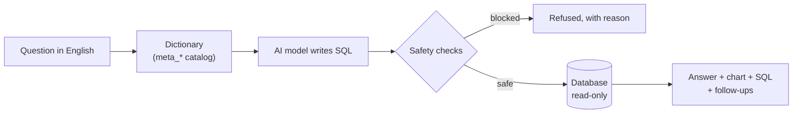

# 1. Project overview

## The problem

IT support teams record every problem as an **incident** and every planned piece of work as a
**change**. Service managers need answers from that data every day:

- Which teams missed their SLA (deadline) most last month?
- How long do we take to fix P1 incidents?
- Which high-risk changes are coming up next week?

Normally someone has to write a database query (SQL) for each question. That is slow, needs a
specialist, and different people calculate the same number in different ways.

## What the platform does

A manager types the question in plain English. The platform:

1. **understands the words** using a built-in dictionary of the organisation's terms
   ("P1" = priority 1, "breach" = resolved later than the SLA target, "last month" = August 2026),
2. **asks an AI model** (OpenAI or Anthropic Claude) to write one SQL query,
3. **checks the query for safety** (read-only, one SELECT, no personal data, row and time
   limits) and runs it,
4. **answers in a sentence**, with a chart, the result table, the SQL it used and three
   suggested follow-up questions.

Around that core it offers a dashboard, a data explorer, an incident detail page, the catalog,
an accuracy test runner (evals) and a page that proves the screens match the database.

## Who it is for

| Person | Uses |
|---|---|
| Service manager | Ask, Dashboard, Incident |
| Analyst / team lead | Explorer, Data check (SQL console), Catalog |
| Data owner | Catalog (definitions, flagged ambiguities) |
| Developer / maintainer | Evals, tests, API docs at `/docs`, this guide |

## The ideas that make it work

| Idea | Why it matters | Where |
|---|---|---|
| **Semantic catalog** | A bare AI guesses table names and definitions. The catalog gives it the exact meaning of every column, metric and business word. | `semantics/build_catalog.py` → `meta_*` tables |
| **Formulas defined once** | MTTR, SLA breach rate and reopen rate are stored as SQL fragments. The agent, the dashboard and the evals all use the same fragment, so numbers always agree. | `meta_metrics` |
| **Guardrails in layers** | Keyword check, read-only connection, allow-list authorizer, row/size/time limits. Any one layer failing is caught by another. | `agent/nl2sql.py` |
| **Refuse, don't guess** | Terms the data cannot answer ("assignee", "downtime") are refused before the AI is called. | `meta_glossary.is_answerable` |
| **Show the working** | Every answer carries its SQL; the Data check page recomputes every screen number independently. | Ask page, `/api/reconcile` |
| **Measure accuracy** | A golden set of questions with known answers scores the agent after every change. | `evals/` |
| **Multi-model** | OpenAI and Anthropic behind one function; switch per question or compare side by side. | `agent/llm.py` |

## The data in one paragraph

Five tables: `assignment_groups` (5 teams), `users` (40), `sla_targets` (4 priorities),
`incidents` (500) and `changes` (100). The data is synthetic and identical on every build
(fixed random seed, "today" = 28 Sep 2026). Exactly 15% of resolved incidents breach their SLA.
A 50,000-incident version exists for scale testing. Details in
[chapter 3](03-Data-Layer.md).

## Technology at a glance

| Layer | Technology |
|---|---|
| Database | SQLite (STRICT tables), Python standard library |
| AI | OpenAI (`gpt-4o-mini`, default) or Anthropic (`claude-opus-5-5`) |
| Backend | FastAPI, Uvicorn, Pydantic |
| Front end | React 19, TypeScript, Vite, Tailwind CSS 4, TanStack Query, Recharts |
| Quality | pytest (130 tests), Playwright end-to-end (22), golden-set evals (80 questions), GitHub Actions CI |
