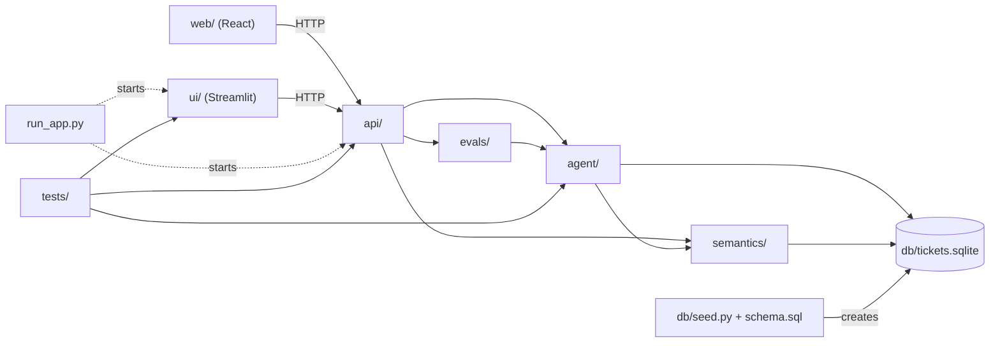

# 2. Folder hierarchy

Every tracked file in the repository, grouped by folder. Files marked *(generated)* or
*(local)* are not in git; see the last section.

```
.
├── README.md                      Project front page: plain-English intro, status, quick start
├── CLAUDE.md                      Project memory for Claude Code: decisions, facts, history, open items
├── requirements.txt               Python dependencies, exact pinned versions
├── run_app.py                     Starts the API (port 8000) and the Streamlit UI (port 8501) together
├── .env.example                   Template for .env: API keys, provider/model choice, API settings
├── .gitignore                     Keeps secrets, databases, logs and caches out of git
│
├── .claude/                       Claude Code tooling used to build the project
│   ├── commands/
│   │   ├── smoke.md               /smoke: rebuild database, row counts, tests, runnable yes/no
│   │   ├── build-catalog.md       /build-catalog: rebuild meta_* tables, list undocumented items
│   │   ├── build-large.md         /build-large: 50k-incident database + golden set + self-test
│   │   └── run-evals.md           /run-evals: accuracy + the 2 worst failures
│   └── skills/
│       └── diagnose-eval-failure/
│           └── SKILL.md           Maps a failed eval to the catalog entry that needs fixing
│
├── .streamlit/
│   └── config.toml                Streamlit theme (brand colours, fonts)
│
├── db/                            DATA LAYER (chapter 3)
│   ├── schema.sql                 The 5 tables: columns, keys, CHECK rules, indexes
│   ├── seed.py                    Builds tickets.sqlite with deterministic synthetic data
│   ├── tickets.sqlite             (generated) 500-incident database + catalog
│   └── tickets_large.sqlite       (generated) 50,000-incident database + catalog
│
├── semantics/                     SEMANTIC LAYER (chapter 4)
│   ├── README.md                  What the catalog is and how to rebuild it
│   └── build_catalog.py           Writes the 5 meta_* tables into a database and self-checks them
│
├── agent/                         AGENT (chapter 5)
│   ├── README.md                  How the agent works
│   ├── nl2sql.py                  Question → catalog context → AI → guarded SQL → rows → answer
│   ├── llm.py                     Model providers (OpenAI, Anthropic), fallback, allow-list, redaction
│   └── naive_spike.py             Day 1 experiment: question → AI with no context (shows the failures)
│
├── api/                           BACKEND (chapter 6)
│   ├── README.md                  Endpoint list and safety rules
│   ├── main.py                    FastAPI app: endpoints, auth, rate limits, headers, audit, eval jobs
│   ├── services.py                Data logic: KPIs, explorer, incident, similar, catalog, reconcile, SQL console
│   ├── schemas.py                 Request/response models (validation)
│   └── config.py                  Settings from environment / .env
│
├── ui/                            STREAMLIT FRONT END (chapter 7)
│   ├── README.md                  Pages and how to run them
│   ├── Home.py                    Entry page: status, dataset size, page cards, safety summary
│   ├── api_client.py              HTTP client + shared page chrome (logo, CSS, header, sidebar)
│   ├── assets/
│   │   ├── logo.svg               Sidebar logo
│   │   └── icon.svg               Browser tab icon
│   └── pages/
│       ├── 1_Ask.py               Question → answer, chart, SQL, follow-ups, feedback, compare models
│       ├── 2_Dashboard.py         KPI tiles with trends, breakdowns, click-a-team drill-down
│       ├── 3_Explorer.py          Browse/filter/sort/export any table
│       ├── 4_Catalog.py           Glossary, metrics, columns, tables, joins
│       ├── 5_Evals.py             Run the golden set (self-test or live) and see results
│       ├── 6_Data_Check.py        UI numbers vs database + read-only SQL console
│       └── 7_Incident.py          One incident: SLA gauge, timeline, similar incidents
│
├── web/                           REACT FRONT END (chapter 8)
│   ├── README.md                  Stack, build commands, file guide
│   ├── package.json               npm dependencies and scripts (dev, build)
│   ├── package-lock.json          Exact dependency versions
│   ├── index.html                 HTML shell; loads the font and src/main.tsx
│   ├── vite.config.ts             Build config: relative base, dev proxy to the API, @ alias
│   ├── tsconfig*.json             TypeScript settings
│   ├── .oxlintrc.json             Linter settings
│   ├── public/favicon.svg         Browser tab icon
│   ├── dist/                      (generated) built site, served by the API at /web/
│   └── src/
│       ├── main.tsx               Mounts the app with the query cache and settings
│       ├── App.tsx                Routes (hash URLs), lazy-loaded pages
│       ├── index.css              Tailwind setup and brand colour tokens
│       ├── lib/
│       │   ├── api.ts             Typed API client + all response types
│       │   └── settings.tsx       Dataset / provider / model choice, saved in the browser
│       ├── components/
│       │   ├── Layout.tsx         Sidebar (navigation, pickers, database status) + page frame
│       │   ├── ui.tsx             Shared building blocks: Card, Button, Stat, DataTable, badges…
│       │   └── AutoChart.tsx      Picks and draws a chart for a query result
│       └── pages/
│           ├── Home.tsx  Ask.tsx  Dashboard.tsx  Explorer.tsx
│           └── Incident.tsx  Catalog.tsx  Evals.tsx  DataCheck.tsx
│
├── evals/                         ACCURACY (chapter 9)
│   ├── README.md                  How scoring works
│   ├── golden_set.yaml            15 questions with reference SQL and expected rows
│   ├── golden_set_large.yaml      The same for the 50k database
│   ├── make_golden_set.py         Generates both golden sets from their reference SQL
│   └── run_evals.py               Scores the agent (live or self-test), JSON report option
│
├── tests/                         AUTOMATED TESTS (chapter 9)
│   ├── conftest.py                Builds a temp database; fake AI model fixture
│   ├── test_guardrails.py         SQL guard, read-only, PII block, timeout
│   ├── test_llm.py                Provider choice, missing keys, fallback
│   ├── test_api.py                Every endpoint end to end with a fake model
│   └── test_security.py           Each known attack as a regression test
│
├── docs/
│   └── images/                    Screenshots used in the READMEs
│
├── End-to-End/                    THIS GUIDE
│
├── .env                           (local) your API keys, never committed
└── logs/audit.jsonl               (generated) audit trail of every question and SQL run
```

## How the folders depend on each other

Arrows point from the user of a module to the module it uses.



- `db/` and `semantics/` use only the Python standard library.
- `agent/` depends on `semantics/` (for `find_term`, `AS_OF`) and on the AI SDKs.
- `api/` imports `agent/`, `semantics/` and `evals/` (it runs eval jobs).
- Neither front end imports Python code from the backend; they only call HTTP endpoints.

## Local and generated files (not in git)

| File | What | How to create |
|---|---|---|
| `.env` | API keys and settings | `cp .env.example .env`, then edit |
| `db/tickets.sqlite` | Default database | `python db/seed.py && python semantics/build_catalog.py` |
| `db/tickets_large.sqlite` | 50k database | `/build-large` or the commands in chapter 12 |
| `web/node_modules/`, `web/dist/` | npm packages and the built React site | `cd web && npm install && npm run build` |
| `logs/audit.jsonl` | Audit trail | Created by the API on the first question |
