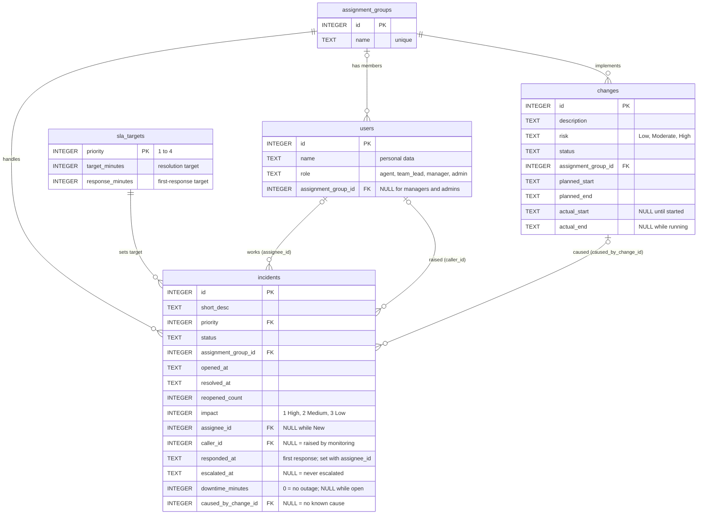

# 3. Data layer (`db/`)

## Files

| File | Role |
|---|---|
| `schema.sql` | Defines the five tables. Drops and recreates them, so it always gives a clean start. |
| `seed.py` | Deletes the database file, runs `schema.sql`, and fills the tables with synthetic data. |
| `tickets.sqlite` | The result (generated, gitignored). About 0.2 MB. |

## The five tables



Since 2026-10-02 incidents link to **users twice** (`assignee_id` = who works it, `caller_id` =
who raised it) and to the **change that caused them** (`caused_by_change_id`). Before that date
these links did not exist and questions about assignees, callers, response times, downtime,
impact, escalations, actual change windows and change-caused incidents were refused. People are
still reported by id and role only: `users.name` stays blocked.

## Rules built into the schema

- Tables are **STRICT**: a value of the wrong type is rejected.
- **CHECK lists** fix the allowed values: incident status `New, In Progress, On Hold,
  Resolved, Closed, Cancelled`; change status `Draft, Assess, Scheduled, Implement, Review,
  Closed, Cancelled`; risk `Low, Moderate, High`; role `agent, team_lead, manager, admin`.
- `resolved_at` is set **if and only if** status is Resolved or Closed, and can never be earlier
  than `opened_at`. A reopen clears it and adds one to `reopened_count`.
- `assignee_id` and `responded_at` are set **together**, never while the status is New, and
  `responded_at` lies between `opened_at` and `resolved_at`. `escalated_at` is on or after
  `opened_at`. `downtime_minutes` is NULL exactly while the incident is open (New, In Progress,
  On Hold). `response_minutes` is always smaller than `target_minutes`.
- Changes: `actual_start` is set exactly for Implement, Review and Closed; `actual_end` exactly
  for Review and Closed, and never before `actual_start`.
- Timestamps are text `'YYYY-MM-DD HH:MM:SS'` in UTC.
- Foreign keys are enforced (`PRAGMA foreign_keys = ON`) and the common filter columns are
  indexed (team + opened date, opened date, priority, status, change start).

## Key business definitions

| Term | Definition |
|---|---|
| **SLA target** | Minutes allowed per priority: P1 240 (4 h), P2 480 (8 h), P3 2880 (2 days), P4 7200 (5 days) |
| **SLA breach** | A Resolved/Closed incident whose `resolved_at - opened_at` (wall-clock minutes) exceeds its target. Not stored; always calculated. |
| **Open** | Status New, In Progress or On Hold (not "resolved_at is null", which would also include Cancelled) |
| **MTTR** | Mean time to resolve, in minutes, over Resolved/Closed incidents |
| **Reopen rate** | Share of incidents with `reopened_count > 0` |
| **Response target** | Minutes allowed for the first response: P1 30, P2 60, P3 240, P4 480 (`response_minutes`) |
| **Response breach** | `responded_at - opened_at` (minutes) exceeds `response_minutes`; also calculated, never stored |
| **Impact** | 1 High (site-wide), 2 Medium (a department), 3 Low (one user). Separate from priority |
| **Downtime** | `downtime_minutes`: 0 = no outage, NULL while the incident is open |
| **Escalated** | `escalated_at IS NOT NULL` |
| **Change overrun** | `actual_end > planned_end` |
| **Forecast** | No model: the agreed projection is the average monthly intake over the last three full months |

Priority words users may type: P1 / Priority 1 / Sev1 / Severity 1 / Critical / urgent fix,
and the same pattern for 2 (High), 3 (Medium) and 4 (Low).

## How `seed.py` generates the data

- **Deterministic**: `random.Random(42)` and a fixed "now" of **2026-09-28 00:00 UTC**. Every
  run produces byte-identical data, so tests and evals have fixed expected answers. The columns
  added on 2026-10-02 are filled by a **second generator** (`random.Random(43)`) in a pass after
  the original rows exist, so every value the original columns held before is unchanged. The catalog
  is built with the same date by default; for real data set `AS_OF=today` (or a date) when
  running `build_catalog.py` and every relative time term, the agent's "today" and the API's
  as-of follow (they read it back from `meta_settings`).
- **Dialect**: `db/dialect.py` holds the three date expressions the project needs
  (`minutes_between`, `date_from`, `month`) for SQLite and PostgreSQL. `DB_DIALECT=postgres` switches the generated text; the
  read-only connection and authorizer are still SQLite-only, and the PostgreSQL output has not
  yet been run against a live server.
- **Realistic shape**: incidents opened more in business hours, priorities weighted 5/15/50/30,
  teams with different workloads, changes biased toward maintenance windows.
- **Engineered facts** for testing: exactly **66 of 440 resolved incidents breach (15.0%)**,
  more at Network and Database; in August 2026 Service Desk has the most breaches by count but
  Database the highest rate (count and rate rank teams differently); two future High-risk
  changes are pinned so "high-risk changes next week" always has an answer. Default-size facts
  for the 2026-10-02 columns: 12 unassigned, 97 raised by monitoring, 55 escalated, 71 with
  downtime, 34 caused by a change (change 78 caused 3), 37 of 488 first responses late (7.6%),
  23 of 86 finished changes overran; user 1 (a team lead) resolved most incidents (24).
- **Scalable**: `--incidents N --changes M --out path` keeps the same ratios (used for the
  50,000-incident database).

| Default dataset | Rows |
|---|---|
| assignment_groups | 5 |
| users | 40 (31 agents, 5 team leads, 3 managers, 1 admin) |
| sla_targets | 4 |
| incidents | 500 (440 resolved/closed, 50 open, 10 cancelled) |
| changes | 100 (90 past, 10 in the next 28 days) |

```bash
python db/seed.py                                                    # default database
python db/seed.py --incidents 50000 --changes 10000 --out db/tickets_large.sqlite
```

**Important:** seeding replaces the whole file, including the catalog, so always run
`python semantics/build_catalog.py` afterwards.
