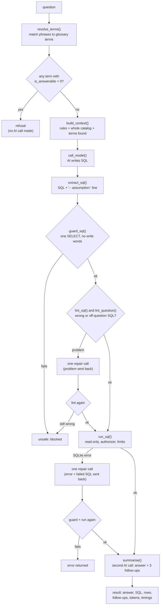

# 5. Agent (`agent/`)

The agent turns a plain-English question into a checked answer. It is used by the API, by the
eval runner and directly from the command line.

## Files

| File | Role |
|---|---|
| `nl2sql.py` | The pipeline: find terms → build context → AI writes SQL → guard → run → repair → answer |
| `llm.py` | The only place that talks to AI providers (OpenAI, Anthropic) |
| `naive_spike.py` | Day 1 experiment, kept on purpose: a bare question to the AI with no context, to show why the rest exists |

## The pipeline: `ask()`



## `nl2sql.py` function by function

| Function | What it does |
|---|---|
| `connect_readonly(db_path, check_same_thread)` | Opens the database with `mode=ro` and sets hard limits: values ≤ 1 MB, SQL ≤ 100 KB, no attached databases, SQLite memory ≤ 512 MB |
| `_denial()` / `_authorizer()` | The SQLite **allow-list**: only select, read, function calls and recursion are permitted; `users.name` and `load_extension` are refused |
| `run_sql(conn, sql)` | Runs SQL with the authorizer and a **5-second timeout** (progress handler); returns at most **1,000 rows**; turns denials into `UnsafeSQL` with a clear reason |
| `resolve_terms(conn, question)` | Tries every 1–4-word phrase, longest first, against `find_term()` |
| `build_context(conn, resolved)` | The system prompt: fixed rules ("today is" the catalog's as-of date, the dialect, one SELECT, never `users.name`, table aliases, team-join rule, "open = New, In Progress and On Hold", follow-up rule, assumption comment) followed by every table, column, join, metric and answerable glossary term from the catalog |
| `call_model()` | One call through `llm.complete()` |
| `with_history(question, history)` | The user message: the last 3 `{question, sql}` turns of the conversation under "CONVERSATION SO FAR", then the new question. History goes in the user message so the system prompt (the catalog) stays identical and the provider's prompt cache hits (measured: about 4,200 of 4,400 prompt tokens cached on OpenAI) |
| `extract_sql(text)` | Pulls the SQL out of the reply's code block and the `-- assumption:` line |
| `guard_sql(sql)` | Rejects empty SQL, more than one statement, anything not starting with SELECT/WITH, and write/admin keywords (strings are ignored when checking); appends `LIMIT 1000` if missing |
| `lint_sql(conn, sql)` | Finds SQL that runs but is certainly wrong: a date modifier SQLite does not know (for example `'start of quarter'`; SQLite returns NULL and a count silently becomes 0), two child tables (incidents, changes, users) joined in one aggregate query (every count is multiplied), and a filter on the parent table inside a `LEFT JOIN ... ON` (it removes no rows). Reads the join paths from `meta_joins`, so nothing is hard-coded |
| `lint_question(question, sql, resolved)` | The soft checks. They compare the SQL with the question and send it back once, but never block: an open-status filter nobody asked for ("P1 incidents"; "opened" is a date, not the status open), `status <> 'Cancelled'` nobody asked for, "show/list" answered with one aggregate value, "how many teams…" answered with one row per team, "average number of X per Y" returned per group or divided by a fixed 12, "X per agent" returned as two counts instead of a ratio, a time of day ("9am to 5pm") compared with one day's timestamp, and a per-team percentage computed as the team's share of the grand total. A glossary term whose hint contains the filter justifies it ("overdue" justifies the open statuses). Follow-up questions skip these checks |
| `translate(question, …)` | Terms → refusal check → context → AI → SQL → lint (one repair call if it fails; blocked if still wrong). No execution. Returns `{terms, refusal, sql, assumption, unsafe, lint, provider, model, tokens…}` |
| `summarise(question, result)` | Second AI call with the question and up to 50 rows; expects JSON `{answer, followups}` |
| `parse_answer(text)` | Reads that JSON; falls back to the plain text if it is not JSON |
| `_fallback_answer()` | Fixed sentence ("The answer is 12.", "No matching records were found.") if the answer call fails |
| `ask(question, …)` | The full pipeline above; used by `POST /api/ask` |
| `main()` | Command line: `python agent/nl2sql.py [--db] [--provider] [--model] "question"` |

**What the model is told** is 100% from the catalog plus a short list of rules; nothing about
the schema is hard-coded. **What the model is never trusted with**: safety. Every guardrail is
enforced in code after the model replies.

## `llm.py`: the model providers

| Item | Details |
|---|---|
| `PROVIDERS` | `openai` (key `OPENAI_API_KEY`, default `gpt-4o-mini`) and `anthropic` (key `ANTHROPIC_API_KEY`, default `claude-opus-5-5`) |
| `complete(system, user, provider, model)` | One call. Returns `LLMReply(text, provider, model, latency_ms, tokens_in, tokens_out)` |
| `_call_openai` | Chat Completions, temperature 0, 60 s timeout, 1 retry |
| `_call_anthropic` | Messages API with prompt caching on the system prompt (the catalog is the same every call), effort `low`, server-side fallback if the model declines |
| Fallback | If `LLM_FALLBACK_PROVIDER` is set and no provider was chosen explicitly, a failed call is retried on the fallback provider |
| `available_providers()` | Which providers have keys (drives the UI pickers and `/health`) |
| `allowed_models(provider)` | Models the API accepts: the configured default plus `LLM_ALLOWED_MODELS` |
| `redact(text)` | Removes API keys from provider error messages |
| `AgentAPIError` | Every provider failure (no key, network, no credit, refusal) becomes this one error, so callers can tell "AI unreachable" from "SQL wrong" |
| `load_env()` | Reads `.env` from the project root into the environment |

## Worked example

Question: *"Which assignment groups breached SLA most last month?"*

1. Terms found: "assignment groups" → *assignment group*, "breached SLA" → *SLA breach*,
   "last month" → *last month*.
2. The AI writes (roughly):
   ```sql
   SELECT g.name, COUNT(s.priority) AS breaches   -- s only matches breached incidents
   FROM assignment_groups g
   LEFT JOIN incidents i ON i.assignment_group_id = g.id
     AND i.status IN ('Resolved','Closed')
     AND i.opened_at >= date('2026-09-28','start of month','-1 month')
     AND i.opened_at <  date('2026-09-28','start of month')
   LEFT JOIN sla_targets s ON s.priority = i.priority
     AND (julianday(i.resolved_at) - julianday(i.opened_at)) * 1440 > s.target_minutes
   GROUP BY g.name ORDER BY breaches DESC
   ```
3. Guard passes; `LIMIT 1000` is added; it runs read-only.
4. Answer: *"Service Desk had the most SLA breaches last month with 4, followed by Network
   with 3, Database with 2 and Application Support with 1."* plus three follow-ups.
