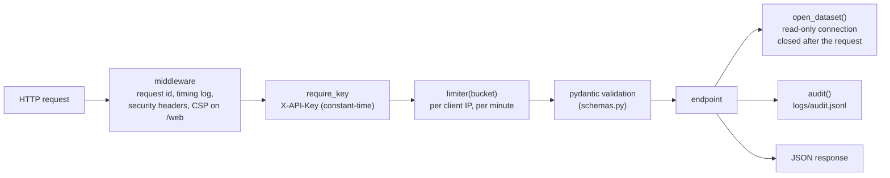

# 6. Backend API (`api/`)

A FastAPI service on port 8000. It is the **only** component that opens the database or
calls the agent; both front ends go through it. Interactive documentation is at
`http://127.0.0.1:8000/docs`.

## Files

| File | Role |
|---|---|
| `main.py` | The app: endpoints, middleware (request id, logging, security headers), API-key check, rate limits, model check, audit log, background eval jobs, React site mount |
| `services.py` | The data logic behind the non-AI endpoints; no AI involved |
| `schemas.py` | Pydantic models that validate requests and shape responses |
| `config.py` | `Settings` loaded once from the environment and `.env`; puts `agent/`, `semantics/`, `evals/` on the import path |

## Endpoints

Every `/api/*` endpoint takes `dataset=default|large` and needs the `X-API-Key` header when
`APP_API_KEY` is set.

| Method | Path | Does | Used by |
|---|---|---|---|
| GET | `/health` | Database files, catalog present, providers configured, "as of" date (always public) | Sidebar status, Home |
| GET | `/api/models` | Providers and default models | Model pickers |
| GET | `/api/overview` | Row counts, catalog counts, incident date range | Home |
| POST | `/api/ask` | Question → `nl2sql.ask()` → answer, SQL, rows, follow-ups (rate-limited, audited) | Ask |
| GET | `/api/kpis` | Headline KPIs, by team, by month, by priority, by status, upcoming changes by risk; optional `date_from`, `date_to`, `group_id` | Dashboard |
| GET | `/api/groups` | Teams (id, name) | Filters |
| GET | `/api/tables` | Data tables with description, row count and columns | Explorer |
| GET | `/api/tables/{name}` | One page of a table; `f_<column>=value` filters, `search`, `sort`, `desc`, `page`, `size` (≤ 200) | Explorer |
| GET | `/api/incidents/{id}` | Incident + team + SLA target, time used, breach flag, SLA due time, timeline | Incident |
| GET | `/api/incidents/{id}/similar` | Most similar incidents (shared description words, same team, same priority) | Incident |
| POST | `/api/feedback` | Thumbs up/down on an answer → audit log (rate-limited) | Ask |
| GET | `/api/catalog/{section}` | `tables`, `columns`, `joins`, `metrics` or `glossary` | Catalog |
| GET | `/api/reconcile` | 25 checks: every number the UI shows vs the same number from independent SQL | Data check |
| POST | `/api/sql` | Your own read-only SELECT through the same guardrails (rate-limited, audited) | Data check |
| POST | `/api/evals` | Start an eval run (self-test or live) in a background thread (rate-limited, max 2 at once) | Evals |
| GET | `/api/evals`, `/api/evals/{id}` | List runs / progress and results of one run | Evals |
| GET | `/web/…` | The built React site (`web/dist`) | Browser |
| GET | `/` | Redirects to `/web/` (or `/docs` if React is not built) | Browser |

## `services.py` function by function

| Function | What it does |
|---|---|
| `connect(db_path)` | Read-only connection (with limits) + authorizer; allowed across FastAPI's worker threads |
| `overview(conn)` | Row counts for the 5 data and 5 catalog tables, first/last incident date |
| `catalog_ready(conn)` | True when all data and `meta_*` tables exist |
| `kpis(conn, date_from, date_to, group_id)` | Builds every dashboard number from `meta_metrics` fragments with `_metric_query()`; breach count = rate × resolved |
| `groups`, `list_tables`, `table_columns` | Lookups for filters and the explorer |
| `browse(conn, table, filters, search, sort, …)` | Explorer page. Table and column names must exist in `meta_columns` (whitelist); values are bound parameters; PII columns are shown as `***` and cannot be filtered or sorted |
| `incident(conn, id)` | Detail with SLA maths and a timeline (opened → SLA due → resolved/now) |
| `similar_incidents(conn, id, limit)` | Jaccard word overlap on the description + 0.1 for the same team + 0.1 for the same priority |
| `catalog(conn, section)` | One catalog table |
| `db_info(path)` | File name, size, last modified (used by the sidebar) |
| `reconcile(conn)` | Compares what the pages show with `DIRECT_CHECKS`, SQL written independently from the schema definitions |
| `run_readonly_sql(conn, sql)` | `guard_sql` + `run_sql` for the SQL console |

## Request handling inside `main.py`

- **A new database connection per request**, closed afterwards, so changes to the database
  file show up immediately without restarting.
- **Errors**: unknown table/column → 400; missing dataset → 404; AI unreachable → 503;
  rate limit → 429 with `Retry-After`; anything unexpected → 500 with a request id only
  (details in the server log, never a stack trace to the client).
- **Audit log**: every ask, SQL console query and feedback is one JSON line: time, request id,
  client, dataset, question/SQL, provider, model, status, row count, tokens, timings.
- **Eval jobs** live in memory (max 50 remembered, max 2 running), each in its own thread.

## Settings (`config.py` and environment)

| Variable | Default | Meaning |
|---|---|---|
| `APP_API_KEY` | *(empty)* | When set, required as `X-API-Key` on `/api/*` |
| `RATE_LIMIT_PER_MIN` | 30 | Per client IP, per bucket (ask, sql, evals, feedback) |
| `CORS_ORIGINS` | Streamlit URLs | Browser origins allowed to call the API from another port |
| `DB_PATH` / `DB_LARGE_PATH` | `db/tickets.sqlite` / `db/tickets_large.sqlite` | The two datasets |
| `AUDIT_LOG` | `logs/audit.jsonl` | Audit file |
| `LLM_*`, `OPENAI_*`, `ANTHROPIC_*` | see chapter 5 | Model providers |

Start it on its own with `uvicorn api.main:app --port 8000`, or with the UI via
`python run_app.py`.
