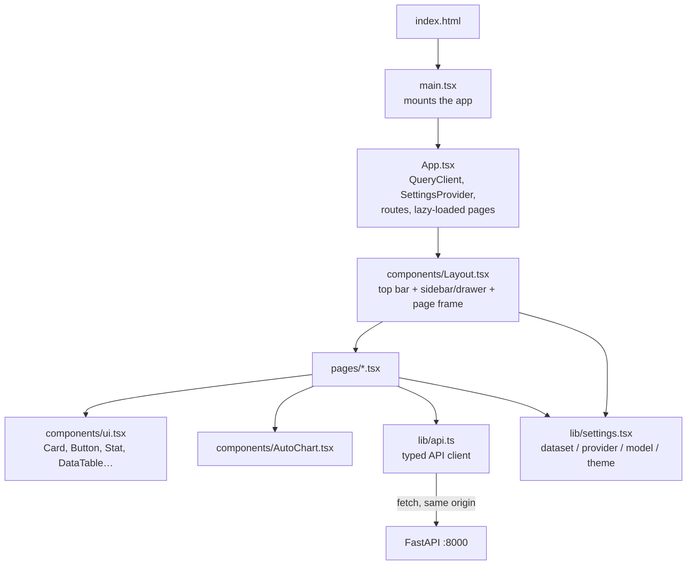

# 7. React front end (`web/`)

The user interface: a single-page web app built with React and TypeScript. After a build it is plain static files that the API serves at `/web/`,
so it needs no server of its own.

```bash
cd web
npm install          # once
npm run build        # -> web/dist, then open http://127.0.0.1:8000/web/
npm run dev          # live-reload development server on :5173 (proxies /api to :8000)
```

## Stack

| Library | Used for |
|---|---|
| React 19 + TypeScript | Components and type safety |
| Vite 8 | Development server and production build |
| Tailwind CSS 4 | Styling (brand colours defined in `src/index.css`) |
| TanStack Query | Fetching and caching API data (10-second freshness, automatic refetch) |
| React Router (hash routes) | Page URLs like `#/dashboard`, which work from a static folder |
| Recharts | Charts (animations turned off so they render reliably) |
| lucide-react | Icons |

## How the files fit together



## File by file

| File | What it does |
|---|---|
| `index.html` | Page shell; loads the Inter font and `src/main.tsx` |
| `vite.config.ts` | Relative base path (so `/web/` works), dev proxy for `/api` and `/health`, `@` = `src/` |
| `src/main.tsx` | Mounts `App` into the page (React strict mode) |
| `src/App.tsx` | Creates the TanStack Query client, wraps everything in `SettingsProvider`, and defines the hash routes: `/`, `/ask`, `/dashboard`, `/explorer`, `/incident`, `/catalog`, `/evals`, `/data-check`; each page is loaded only when first opened |
| `src/index.css` | Tailwind import and the brand colour tokens |
| `src/lib/api.ts` | Every endpoint as a typed function (`api.ask`, `api.kpis`, `api.browse`, …) and the TypeScript types of every response; sends `X-API-Key` if `VITE_APP_API_KEY` was set at build time |
| `src/lib/settings.tsx` | `SettingsProvider` / `useSettings()`: the chosen dataset, provider, model and light/dark theme, remembered in the browser (`localStorage`, safely ignored if blocked); `applyTheme()` puts the `dark` class on `<html>` |
| `src/routes.ts` | The page-module map used by the router and by the prefetch (`preloadPage`, `preloadAllPages`) |
| `src/index.css` | Tailwind setup, the light and dark colour tokens (`--surface`, `--ink`, `--line`, tones, chart colours), the page-enter animation |
| `src/components/Layout.tsx` | Top bar (menu button on small screens, page name, **theme toggle top right**), sidebar on desktop or slide-in drawer below 1024 px with navigation, dataset/provider/model pickers, connected database file and time, Refresh button; `useHealth()` and `useModel()` hooks |
| `src/components/ui.tsx` | Shared building blocks: `Card`, `CardTitle`, `PageHeader`, `Button`, `Select`, `Input`, `Badge`, `Spinner`, `ErrorBox`, `Notice`, `Stat` (KPI tile with sparkline and delta), `DataTable`, `downloadCsv`, and the `PRIORITY` / `STATUS` / `RISK` colour maps |
| `src/components/AutoChart.tsx` | `chartSpec()` decides whether a result can be charted (one label column + a number, 2–60 rows) and whether it is a time series; `AutoChart` draws a line or horizontal bar chart |

## Pages

| Page | What it shows | API calls | Link shortcuts |
|---|---|---|---|
| `Home.tsx` | Status, provider readiness, row counts, page cards, safety summary | `overview` (status comes from the layout's `health`) | — |
| `Ask.tsx` | Chat-style questions; answer, Chart / Table / SQL tabs, CSV, token and time info, thumbs up/down, follow-up chips, compare two models | `ask`, `feedback` | `#/ask?q=<question>` asks immediately |
| `Dashboard.tsx` | Six KPI tiles with sparklines and deltas, breaches by team (count/rate, click to drill down), team scorecard, monthly trend, priority, status, upcoming changes by risk; date and team filters | `kpis`, `groups` | — |
| `Explorer.tsx` | Table tabs, filters, search, sort, paging, CSV; click a row to open the incident | `tables`, `browse`, `groups` | `#/explorer?table=incidents&team=Network` |
| `Incident.tsx` | SLA figures, gauge, timeline, similar incidents | `incident`, `similar` | `#/incident?id=7` |
| `Catalog.tsx` | Glossary cards with search and filter, metrics, columns, tables, joins | `catalog` | — |
| `Evals.tsx` | Run self-test or live evals and see per-question results | `startEval`, `evalJob` | — |
| `DataCheck.tsx` | 25 UI-vs-database checks and the SQL console with examples | `reconcile`, `sql` | — |

## Rules for changing the React code

- `useEffect` bodies use braces and return nothing (newer browsers return a Promise from
  `scrollIntoView`, which React would call as a cleanup and crash).
- Keep `isAnimationActive={false}` on charts; animations never finish in headless screenshots.
- The API sends a strict Content-Security-Policy for `/web`: only the app's own scripts,
  Google Fonts and inline styles are allowed. Loading anything from another site needs a CSP
  change in `api/main.py` (`WEB_CSP`).
- `VITE_APP_API_KEY` is baked into the public bundle, so anyone who can open the page can read
  it: use it only for internal deployments.
- Screenshot check: `msedge --headless=new --screenshot=out.png --window-size=1440,1000
  --virtual-time-budget=10000 "http://127.0.0.1:8000/web/#/dashboard"`.

## Theme, responsiveness and page switching (added 2026-09-30)

- **Light / dark.** One toggle in the top bar, visible on every page. First visit follows the
  operating system; the choice is then stored with the other settings. `?theme=dark` or
  `?theme=light` in the URL forces a theme for that load. Dark mode is a class on `<html>`,
  applied in `main.tsx` before React renders so there is no light flash. Components use
  semantic classes (`bg-surface`, `text-ink`, `text-muted`, `border-line`, `bg-tone-warn` …)
  defined once in `index.css` with a light and a dark value; nothing page-specific was needed.
  Charts read the same variables for grid lines, tick labels and the tooltip box.
- **Responsive.** Below 1024 px the sidebar becomes a drawer behind the menu button; padding,
  the header band and the KPI grids step down; wide tables scroll inside their card.
- **Swift page switches.** Pages are still code-split, but all chunks are prefetched in idle
  time right after the first render and on hover of a sidebar link, and query results are kept
  for 10 minutes, so a click shows the page immediately with a short fade-in.
- **Keyboard and screen readers.** The drawer takes focus when it opens, keeps Tab inside it,
  closes on Escape and hands focus back to the menu button; the theme switch is a labelled
  `role="switch"`.

## Threads, saved questions and eval history (added 2026-09-30)

- **Follow-up questions.** The Ask page sends the last three exchanges of the current thread
  that produced SQL (`history: [{question, sql}]`) with each new question, so "and by
  priority?" is answered in the context of the previous answer. Clear starts a new thread; in
  compare mode both models get the same history.
- **Saved questions.** The star next to a question keeps it in the browser (localStorage key
  `itsm-insights-saved`, twenty most recent, no duplicates). Saved questions show as chips above
  the examples on Ask and in a "Your saved questions" card on Home; clicking one asks it again.
- **Eval history.** The Evals page lists the stored runs for the chosen golden set (from
  `GET /api/evals/history`), lets you open any run's per-question results, and shows a "Flaky
  questions" card: questions that did not pass in every stored live run, with the failures
  behind each. Empty states appear until runs exist or on an API without those endpoints.

## End-to-end tests (`web/e2e/`, added 2026-09-30)

Playwright drives the built app in the system Edge browser against the real API (started on
port 8010 by the test runner, or an existing one with `E2E_PORT=8000`). The suite checks every
page in light and dark with no console errors, the theme toggle position and persistence, the
phone drawer (open, Escape, focus return), that page switches never show the chunk-loading
spinner, saved questions and the Evals history cards. No question is ever submitted, so no
model credit is spent. Run it with `npm run e2e` in `web/`.
