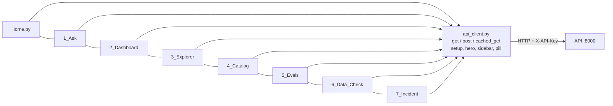

# 7. Streamlit front end (`ui/`)

The first user interface, written in Python with Streamlit, on port 8501. It is a thin layer:
it never opens the database or calls an AI model. Everything goes through the API.

```bash
python run_app.py          # starts the API and this UI; open http://localhost:8501
```

## Structure

Streamlit builds the navigation from the file names: `Home.py` is the start page and every
file in `pages/` becomes a page, ordered by its number prefix.



## `api_client.py`: shared by every page

| Function | What it does |
|---|---|
| `get(path, **params)` / `post(path, body)` | HTTP calls to `API_URL` with the `X-API-Key` header; errors become `APIError` with a message safe to show |
| `cached_get(...)` | Same as `get`, cached for 10 seconds (the sidebar's **Refresh from database** button clears it) |
| `setup(title)` | Page title, icon, logo and the shared CSS |
| `hero(title, subtitle)` | The coloured header band at the top of each page |
| `sidebar()` | Dataset, model provider and model pickers (kept across pages in `session_state`), connected database file and last-changed time, Refresh button |
| `current_model()` | The provider and model chosen in the sidebar |
| `pill(text, color)` | A coloured label (HTML-escaped) for priority, status and team |
| `PRIORITY_COLORS`, `STATUS_COLORS` | One colour scheme used on every page |

Theme colours and fonts are in `.streamlit/config.toml`; the logo and tab icon in `ui/assets/`.

## The pages

| Page | What the user does | API calls | Notable details |
|---|---|---|---|
| `Home.py` | Sees service status, dataset size and cards linking to every page | `/health`, `/api/overview` | Safety summary box |
| `1_Ask.py` | Types a question; sees the answer, a chart, the table, the SQL; clicks a follow-up; rates the answer | `POST /api/ask`, `POST /api/feedback` | **Compare two models** side by side (two API calls in parallel threads); `auto_chart()` picks a bar or line chart; CSV download |
| `2_Dashboard.py` | Reads KPIs with sparklines and month-on-month arrows; switches count/rate; filters by date and team; clicks a team | `/api/kpis`, `/api/groups` | Clicking a team opens the Explorer filtered to that team (`st.switch_page`); breaches, MTTR and reopen use "lower is better" colours |
| `3_Explorer.py` | Picks a table, filters, searches, sorts, pages, downloads CSV; opens an incident | `/api/tables`, `/api/tables/{name}`, `/api/groups` | User names shown as `***` |
| `4_Catalog.py` | Browses glossary, metrics, columns, tables and joins | `/api/catalog/{section}` | Ambiguous and not-answerable items highlighted |
| `5_Evals.py` | Runs the golden set (self-test free, live uses API credit) and follows progress | `POST /api/evals`, `/api/evals/{id}` | Session history to compare models |
| `6_Data_Check.py` | Sees 25 UI-vs-database checks; runs own SQL | `/api/reconcile`, `POST /api/sql` | Shows the SQL used for each check |
| `7_Incident.py` | Enters an incident id; sees SLA gauge, timeline and similar incidents | `/api/incidents/{id}`, `/api/incidents/{id}/similar` | Gauge drawn with Altair |

## Rules for changing the Streamlit code

- Code running in a worker thread (the compare-models calls in `1_Ask.py`) must not touch
  `st.session_state` or any `st.*` function: pass values in as arguments.
- Any text from the API that goes into raw HTML (`st.html`, `unsafe_allow_html=True`) must be
  escaped with `html.escape` (see `pill()`).
- `st.switch_page` cannot be tested with Streamlit's `AppTest`; check page jumps in the real app.
- Streamlit has **no login**. Keep it on `127.0.0.1` (the default) or behind a login proxy.
