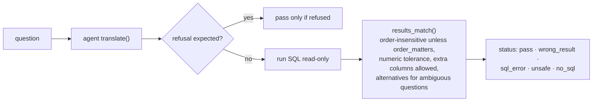

# 8. Evals and tests (`evals/`, `tests/`)

Two different kinds of checking:

| | Evals | Tests |
|---|---|---|
| Question answered | *Does the AI write SQL that gives the right answer?* | *Does the code behave correctly?* |
| Uses the real AI | Yes in live mode (costs API credit); no in self-test | Never (a fake model) |
| Pass mark | Execution accuracy, e.g. 51/51 | Every test passes |
| Run with | `python evals/run_evals.py` or `/run-evals` | `python -B -m pytest tests -p no:cacheprovider` |

## Evals

### Files

| File | Role |
|---|---|
| `golden_set.yaml` | 51 questions for the default database, each with `reference_sql`, `expected` rows and scoring options |
| `golden_set_large.yaml` | The same questions for the 50,000-incident database (the file names its database) |
| `make_golden_set.py` | Generates both files: runs each reference SQL and stores the result as the expected rows, so expected values are never typed by hand |
| `run_evals.py` | Asks the agent each question, runs its SQL and compares the rows with the expected rows |

### The 51 questions

The first 15 (E01–E04, D01–D04, J01–J04, K01–K03) were written with the agent; 35 more were
added on 2026-09-30 from the questions a service manager would actually ask of this data.

| Category | IDs | Tests |
|---|---|---|
| Easy lookup | E01–E12 | Totals and single filters: incidents, open P1s and open tickets, on-hold, reopened (once, more than once), agents, the SLA target for P2 and for Critical in hours, high-risk and cancelled low-risk changes, the most common incident description |
| Date range | D01–D13 | Last month, this month, per month, past month (30 days), last week, next week (D02 and the per-team D11, whose two readings give different rows), an explicit month, changes planned this month (time column `planned_start`), resolved this month (time column `resolved_at`), MTTR last month, upcoming changes |
| Multi-table join | J01–J14 | Breaches by team last month, breach rate per priority and per team, team with the highest breach **rate** (not count), MTTR by priority and the slowest priority, reopen rate per team, open and overdue incidents per team, agents and users per team, upcoming changes per team, Service Desk incidents resolved within SLA |
| Edge case | K01–K12 | Groups with **zero** counts that must still appear (zero breaches, no open P1s), answers that are 0 rather than empty (Network cancelled, cancelled P1s, opened in 2025, opened last month and still open), a team that does not exist, the overall reopen rate (percent or ratio), the longest-running incident, two questions that must be **refused** (assignee, response time), and K12 "incidents assigned to the Network team" (a team count that used to be refused because "assigned to" was an assignee synonym) |

### How a question is scored (`score()`)

- **Self-test** (`--self-test`) scores the reference SQL instead of the AI. It costs nothing
  and proves the golden set and scoring still agree with the database (51/51 expected).
- **Live** calls the AI. `--provider` and `--model` score another model; `--json` prints a
  machine-readable report; `--golden` picks the file.
- If the AI cannot be reached the run stops (exit code 2) instead of counting failures.

Current results (2026-09-30): self-test 51/51 on both datasets; live `gpt-4o-mini` 50/50 on both
datasets on the third run of the 50-question set, after two runs at 47–48/50 that corrected three
reference readings (J13, D07, K05) and showed one intermittent agent miss (K07 dropped `On Hold`
from "open", since then a hard prompt rule). After the improvement round of the same day (51 questions, final prompt wording): 51/51 on both
datasets in two consecutive runs each.

Every run started from the Evals page is now stored (`logs/state.sqlite`) and the page shows
recent runs and the questions that did not pass every time, so flakiness is visible without
re-running by hand. GitHub Actions (`.github/workflows/ci.yml`) runs the tests, both self-tests
and the React build on every push.
Anthropic has not been scored live yet (no key configured).

**When evals fail:** in Claude Code, the `diagnose-eval-failure` skill maps each failure to the
catalog entry that is missing or wrong (metric, join, filter or term).

## Tests

`tests/conftest.py` builds a **fresh database in a temporary folder** (never touching
`db/tickets.sqlite`) and provides a `fake_model` fixture that replaces the AI with queued
replies, so tests are free, fast (about 4 seconds) and repeatable.

| File | Tests | Covers |
|---|---|---|
| `test_guardrails.py` | 11 | `guard_sql` rejections, `LIMIT` handling, keywords inside strings, assumption parsing, `users.name` blocked even via `SELECT *`, read-only database, timeout |
| `test_llm.py` | 6 | Default provider/model, key detection, missing key, unknown provider, explicit provider, fallback only when not explicit |
| `test_api.py` | 33 | Every endpoint: health, KPIs against the known seed facts (66/440 breaches, August counts), explorer paging/filters/masking, incident and similar, catalog, ask (answer, refusal, unsafe, PII, repair, fallback answer, 503, validation), API key, rate limit, eval jobs, reconcile 25/25, SQL console, live database changes, follow-ups, feedback, cross-thread connections |
| `test_security.py` | 18 | Each known attack: pragma functions, row cap, huge values, `load_extension`, timeouts, generated SQL, rate-limit bypass, model allow-list, key redaction, non-ASCII key, security headers, request id, eval cap |
| **Total** | **68** | |

## Rules

- Run Python with `-B` and pytest with `-p no:cacheprovider` so no `__pycache__` or cache
  folders appear in the repository.
- A new bug gets a test that fails before the fix and passes after it.
- After changing the catalog or the agent prompt, run the **whole** golden set live, more than
  once: the AI is not perfectly deterministic even at temperature 0.
- If `seed.py` changes, regenerate the golden sets with `make_golden_set.py`.
