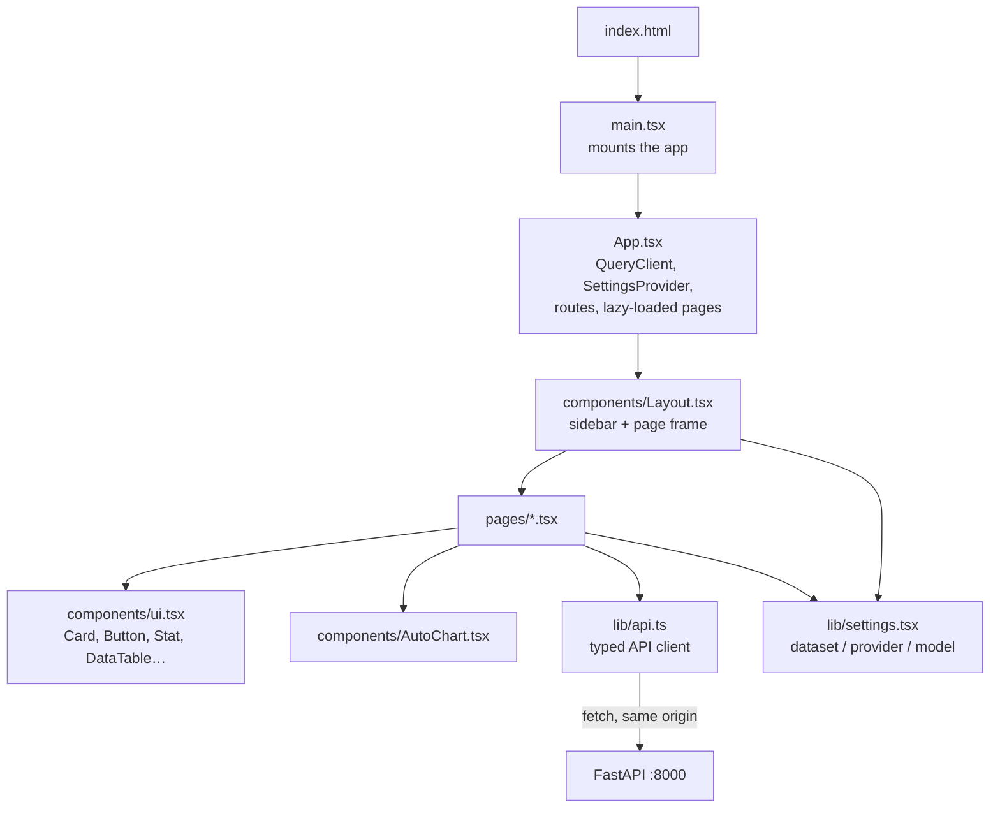

# 8. React front end (`web/`)

The second user interface: the same pages as Streamlit, built as a single-page web app with
React and TypeScript. After a build it is plain static files that the API serves at `/web/`,
so it needs no server of its own.

```bash
cd web
npm install          # once
npm run build        # -> web/dist, then open http://127.0.0.1:8000/web/
npm run dev          # live-reload development server on :5173 (proxies /api to :8000)
```

## Stack

| Library | Used for |
|---|---|
| React 19 + TypeScript | Components and type safety |
| Vite 8 | Development server and production build |
| Tailwind CSS 4 | Styling (brand colours defined in `src/index.css`) |
| TanStack Query | Fetching and caching API data (10-second freshness, automatic refetch) |
| React Router (hash routes) | Page URLs like `#/dashboard`, which work from a static folder |
| Recharts | Charts (animations turned off so they render reliably) |
| lucide-react | Icons |

## How the files fit together



## File by file

| File | What it does |
|---|---|
| `index.html` | Page shell; loads the Inter font and `src/main.tsx` |
| `vite.config.ts` | Relative base path (so `/web/` works), dev proxy for `/api` and `/health`, `@` = `src/` |
| `src/main.tsx` | Mounts `App` into the page (React strict mode) |
| `src/App.tsx` | Creates the TanStack Query client, wraps everything in `SettingsProvider`, and defines the hash routes: `/`, `/ask`, `/dashboard`, `/explorer`, `/incident`, `/catalog`, `/evals`, `/data-check`; each page is loaded only when first opened |
| `src/index.css` | Tailwind import and the brand colour tokens |
| `src/lib/api.ts` | Every endpoint as a typed function (`api.ask`, `api.kpis`, `api.browse`, …) and the TypeScript types of every response; sends `X-API-Key` if `VITE_APP_API_KEY` was set at build time |
| `src/lib/settings.tsx` | `SettingsProvider` / `useSettings()`: the chosen dataset, provider and model, remembered in the browser (`localStorage`, safely ignored if blocked) |
| `src/components/Layout.tsx` | Sidebar with navigation, dataset/provider/model pickers, connected database file and time, Refresh button; `useHealth()` and `useModel()` hooks |
| `src/components/ui.tsx` | Shared building blocks: `Card`, `CardTitle`, `PageHeader`, `Button`, `Select`, `Input`, `Badge`, `Spinner`, `ErrorBox`, `Notice`, `Stat` (KPI tile with sparkline and delta), `DataTable`, `downloadCsv`, and the `PRIORITY` / `STATUS` / `RISK` colour maps |
| `src/components/AutoChart.tsx` | `chartSpec()` decides whether a result can be charted (one label column + a number, 2–60 rows) and whether it is a time series; `AutoChart` draws a line or horizontal bar chart |

## Pages

| Page | What it shows | API calls | Link shortcuts |
|---|---|---|---|
| `Home.tsx` | Status, provider readiness, row counts, page cards, safety summary | `overview` (status comes from the layout's `health`) | — |
| `Ask.tsx` | Chat-style questions; answer, Chart / Table / SQL tabs, CSV, token and time info, thumbs up/down, follow-up chips, compare two models | `ask`, `feedback` | `#/ask?q=<question>` asks immediately |
| `Dashboard.tsx` | Six KPI tiles with sparklines and deltas, breaches by team (count/rate, click to drill down), team scorecard, monthly trend, priority, status, upcoming changes by risk; date and team filters | `kpis`, `groups` | — |
| `Explorer.tsx` | Table tabs, filters, search, sort, paging, CSV; click a row to open the incident | `tables`, `browse`, `groups` | `#/explorer?table=incidents&team=Network` |
| `Incident.tsx` | SLA figures, gauge, timeline, similar incidents | `incident`, `similar` | `#/incident?id=7` |
| `Catalog.tsx` | Glossary cards with search and filter, metrics, columns, tables, joins | `catalog` | — |
| `Evals.tsx` | Run self-test or live evals and see per-question results | `startEval`, `evalJob` | — |
| `DataCheck.tsx` | 25 UI-vs-database checks and the SQL console with examples | `reconcile`, `sql` | — |

## Rules for changing the React code

- `useEffect` bodies use braces and return nothing (newer browsers return a Promise from
  `scrollIntoView`, which React would call as a cleanup and crash).
- Keep `isAnimationActive={false}` on charts; animations never finish in headless screenshots.
- The API sends a strict Content-Security-Policy for `/web`: only the app's own scripts,
  Google Fonts and inline styles are allowed. Loading anything from another site needs a CSP
  change in `api/main.py` (`WEB_CSP`).
- `VITE_APP_API_KEY` is baked into the public bundle, so anyone who can open the page can read
  it: use it only for internal deployments.
- Screenshot check: `msedge --headless=new --screenshot=out.png --window-size=1440,1000
  --virtual-time-budget=10000 "http://127.0.0.1:8000/web/#/dashboard"`.
