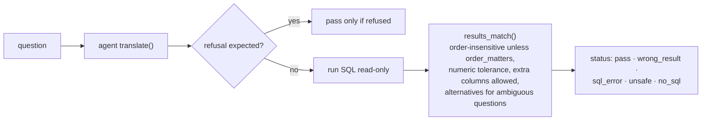

# 9. Evals and tests (`evals/`, `tests/`)

Two different kinds of checking:

| | Evals | Tests |
|---|---|---|
| Question answered | *Does the AI write SQL that gives the right answer?* | *Does the code behave correctly?* |
| Uses the real AI | Yes in live mode (costs API credit); no in self-test | Never (a fake model) |
| Pass mark | Execution accuracy, e.g. 15/15 | Every test passes |
| Run with | `python evals/run_evals.py` or `/run-evals` | `python -B -m pytest tests -p no:cacheprovider` |

## Evals

### Files

| File | Role |
|---|---|
| `golden_set.yaml` | 15 questions for the default database, each with `reference_sql`, `expected` rows and scoring options |
| `golden_set_large.yaml` | The same questions for the 50,000-incident database (the file names its database) |
| `make_golden_set.py` | Generates both files: runs each reference SQL and stores the result as the expected rows, so expected values are never typed by hand |
| `run_evals.py` | Asks the agent each question, runs its SQL and compares the rows with the expected rows |

### The 15 questions

| Category | IDs | Tests |
|---|---|---|
| Easy lookup | E01–E04 | Total incidents, open P1s, the SLA target for P2, high-risk changes |
| Date range | D01–D04 | Opened last month, high-risk changes next week, opened in the past month, resolved last week |
| Multi-table join | J01–J04 | Breaches by team last month, breach rate per priority, open incidents per team, team with most agents |
| Edge case | K01–K03 | Teams with **zero** breaches last month (must still appear), Network's cancelled incidents, "who is the assignee of incident 101?" (must be **refused**) |

### How a question is scored (`score()`)

- **Self-test** (`--self-test`) scores the reference SQL instead of the AI. It costs nothing
  and proves the golden set and scoring still agree with the database (15/15 expected).
- **Live** calls the AI. `--provider` and `--model` score another model; `--json` prints a
  machine-readable report; `--golden` picks the file.
- If the AI cannot be reached the run stops (exit code 2) instead of counting failures.

Current results: self-test 15/15; live `gpt-4o-mini` 15/15 on repeated runs on both datasets.
Anthropic has not been scored live yet (no key configured).

**When evals fail:** in Claude Code, the `diagnose-eval-failure` skill maps each failure to the
catalog entry that is missing or wrong (metric, join, filter or term).

## Tests

`tests/conftest.py` builds a **fresh database in a temporary folder** (never touching
`db/tickets.sqlite`) and provides a `fake_model` fixture that replaces the AI with queued
replies, so tests are free, fast (about 4 seconds) and repeatable.

| File | Tests | Covers |
|---|---|---|
| `test_guardrails.py` | 11 | `guard_sql` rejections, `LIMIT` handling, keywords inside strings, assumption parsing, `users.name` blocked even via `SELECT *`, read-only database, timeout |
| `test_llm.py` | 6 | Default provider/model, key detection, missing key, unknown provider, explicit provider, fallback only when not explicit |
| `test_api.py` | 33 | Every endpoint: health, KPIs against the known seed facts (66/440 breaches, August counts), explorer paging/filters/masking, incident and similar, catalog, ask (answer, refusal, unsafe, PII, repair, fallback answer, 503, validation), API key, rate limit, eval jobs, reconcile 25/25, SQL console, live database changes, follow-ups, feedback, cross-thread connections |
| `test_security.py` | 19 | Each known attack: pragma functions, row cap, huge values, `load_extension`, timeouts, generated SQL, rate-limit bypass, model allow-list, key redaction, non-ASCII key, security headers, request id, eval cap, HTML escaping |
| **Total** | **69** | |

## Rules

- Run Python with `-B` and pytest with `-p no:cacheprovider` so no `__pycache__` or cache
  folders appear in the repository.
- A new bug gets a test that fails before the fix and passes after it.
- After changing the catalog or the agent prompt, run the **whole** golden set live, more than
  once: the AI is not perfectly deterministic even at temperature 0.
- If `seed.py` changes, regenerate the golden sets with `make_golden_set.py`.
