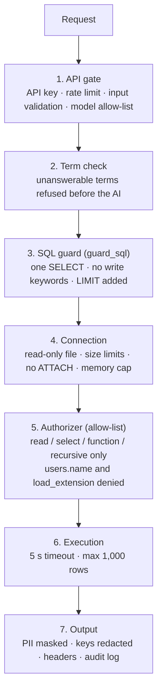

# 9. Security

Security is built in layers, so that if one layer misses something the next one catches it.
Every protection below is enforced in code, not by trusting the AI, and every known attack
is a test in `tests/test_security.py`.

## Protections and where they live

| Threat | Protection | Where |
|---|---|---|
| Changing or deleting data | Database opened with `mode=ro`; only `SELECT`/`WITH` accepted; write keywords rejected; authorizer denies anything but reading | `nl2sql.connect_readonly`, `guard_sql`, `_denial` |
| Several statements in one (`; DROP …`) | More than one statement rejected (semicolons inside strings ignored) | `guard_sql` |
| Reading personal data (`users.name`) | Authorizer denies it everywhere, even through `SELECT *`, sub-queries or JSON functions; the explorer shows `***` and refuses to filter or sort on it | `_denial`, `services.browse` |
| Revealing server details (`pragma_database_list` showed the file path) | Allow-list authorizer denies pragma table functions and every non-read action | `_denial` |
| Loading native code | `load_extension` denied (and disabled by Python by default) | `BLOCKED_FUNCTIONS` |
| Huge results (`LIMIT 3000000`) | At most 1,000 rows fetched whatever the SQL says | `run_sql` (`fetchmany`) |
| Memory bombs (`zeroblob(400000000)`) | Values ≤ 1 MB, SQL ≤ 100 KB, SQLite heap ≤ 512 MB | `connect_readonly` |
| Slow queries | Interrupted after 5 seconds | `run_sql` progress handler |
| SQL injection in the explorer | Table and column names checked against `meta_columns`; values always bound parameters | `services.browse` |
| Questions the data cannot answer | Refused before any AI call | `translate` + `meta_glossary.is_answerable` |
| Unauthorised API use | `APP_API_KEY` → `X-API-Key` required, compared in constant time | `main.require_key` |
| Flooding / cost abuse | Per-IP rate limits per bucket (ask, sql, evals, feedback); max 2 eval runs; only allow-listed models | `main.limiter`, `MAX_RUNNING_JOBS`, `check_model`, `llm.allowed_models` |
| Rate-limit bypass by changing headers | Clients identified by IP address, never by a header | `main.limiter` |
| Leaking API keys in errors | Keys removed from provider error messages | `llm.redact` |
| Leaking internals in errors | Unexpected errors return only a request id; details go to the server log | `main.request_context` |
| Clickjacking, content sniffing, script injection in the browser | `X-Frame-Options: DENY`, `nosniff`, `Referrer-Policy`, strict CSP on `/web` | `main.SECURITY_HEADERS`, `WEB_CSP` |
| Log/header injection via request id | Only short plain tokens accepted | `main.REQUEST_ID` |
| Accidental exposure to the network | `run_app.py` refuses a non-local `--host` without `APP_API_KEY` | `run_app.py` |
| Secrets in git | `.env`, databases and logs are gitignored; staged changes are scanned before every push | `.gitignore`, working rules |
| Who asked what | Every question, SQL console query and rating recorded | `logs/audit.jsonl` |

## Known limits (accepted)

- The React UI has **no login** of its own; keep it on `127.0.0.1` or put it behind a login proxy.
- `/docs` and `/health` are public (they show the API's shape and which providers are
  configured, no ticket data).
- Rate limits and eval jobs are kept in memory, so they reset on restart and do not work
  across several server processes.
- One shared API key, no individual user accounts.
- `VITE_APP_API_KEY` in a React build is readable by anyone who can open the page.

## Checklist before exposing the app beyond this computer

1. Set a long random `APP_API_KEY` in `.env`.
2. Run behind HTTPS (a reverse proxy such as nginx or a cloud load balancer).
3. Put the UI behind a login, or do not expose it.
4. Keep `RATE_LIMIT_PER_MIN` low and `LLM_ALLOWED_MODELS` to the models you pay for.
5. Rotate AI provider keys that have ever been pasted anywhere.
6. Watch `logs/audit.jsonl`.
