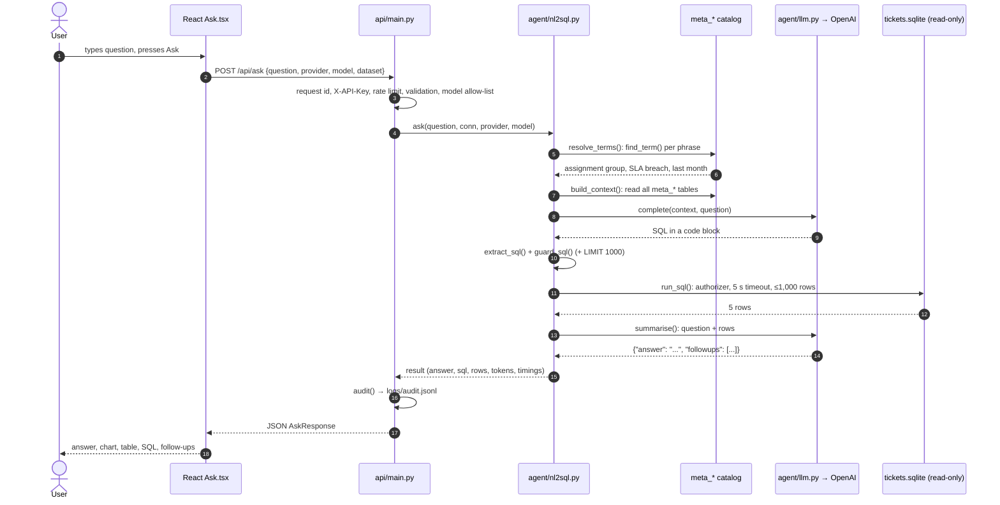

# 11. Request lifecycle: one question, start to finish

This chapter follows a single question through every layer, naming the exact file and
function at each step. Use it to find where to look when something goes wrong.

**Question typed on the React Ask page:** *"Which assignment groups breached SLA most last month?"*

## Step by step

| # | Where | What happens |
|---|---|---|
| 1 | `web/src/pages/Ask.tsx` → `ask()` | Reads dataset, provider and model from `useSettings()` / `useModel()` and calls `api.ask()` |
| 2 | `web/src/lib/api.ts` → `request()` | `fetch('/api/ask')` on the same origin, with `X-API-Key` if configured |
| 3 | `api/main.py` → `request_context` | Assigns a request id, starts the timer, will add security headers to the response |
| 4 | `require_key`, `rate_limit`, `AskRequest` | Rejects a missing key (401), too many requests (429), or a bad body (422) |
| 5 | `ask()` → `check_model()` | Unknown provider or a model not on the allow-list → 400 |
| 6 | `open_dataset()` → `services.connect()` | Opens a fresh read-only connection with limits and the authorizer |
| 7 | `nl2sql.ask()` → `translate()` → `resolve_terms()` | Every 1–4-word phrase is looked up with `find_term()`; an unanswerable term would stop here with a refusal |
| 8 | `build_context()` | Rules + every table, column, join, metric and glossary term → system prompt |
| 9 | `llm.complete()` → `_call_openai()` | The AI returns SQL; tokens and time are recorded |
| 10 | `extract_sql()`, `guard_sql()` | Assumption line pulled out; SQL checked; `LIMIT 1000` appended |
| 11 | `run_sql()` | Executed read-only; if SQLite reports an error, `ask()` sends one repair request and tries again |
| 12 | `summarise()` → `parse_answer()` | Second AI call writes the sentence and three follow-ups; fixed sentence if it fails |
| 13 | back in `main.ask()` | Connection closed; one audit line written; `AskResponse` returned |
| 14 | `Ask.tsx` → `Result` | Shows the answer, `AutoChart` (bar chart here), Table and SQL tabs, CSV, timing and tokens, thumbs up/down, follow-up chips |

## The same shape for the other pages

The non-AI pages follow a shorter path: page → `lib/api.ts` → endpoint in `api/main.py` →
function in `api/services.py` → read-only SQL → JSON → page. For example the Dashboard calls
`GET /api/kpis`, which runs `services.kpis()`; every formula comes from `meta_metrics`.

## Where to look when…

| Symptom | Look at |
|---|---|
| Wrong number in an answer | The SQL tab, then the catalog entry for the term/metric (`/run-evals`, `diagnose-eval-failure`) |
| "Blocked by guardrail" | `guard_sql` / `_denial` reason in the message |
| 503 "language model could not be reached" | `.env` key, provider credit, `logs/audit.jsonl` (`model_error`) |
| 429 | `RATE_LIMIT_PER_MIN` or two evals already running |
| Dashboard number looks wrong | Data check page: it recomputes each number independently |
| Page blank in React | Browser console; CSP in `api/main.py` if a new external resource was added |
| Any 500 | Server log, search for the request id shown in the error |
