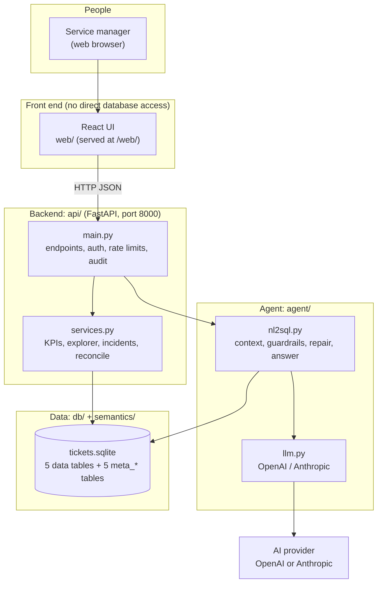

# End-to-End Guide: the ITSM NL2SQL Platform

This folder is the complete reference for the project: every folder, every script and every
component, and how they work together from the database to the screen. Read it front to back
the first time; afterwards use it as a lookup.

## Reading order

| # | Chapter | What you learn |
|---|---|---|
| 1 | [Project overview](01-Project-Overview.md) | What the platform does, who it is for, the ideas behind it |
| 2 | [Folder hierarchy](02-Folder-Hierarchy.md) | Every folder and file in the repository, with one line on each |
| 3 | [Data layer (`db/`)](03-Data-Layer.md) | The five tables, the rules, and how the sample data is generated |
| 4 | [Semantic layer (`semantics/`)](04-Semantic-Layer.md) | The `meta_*` dictionary that tells the AI what the data means |
| 5 | [Agent (`agent/`)](05-Agent.md) | How a question becomes safe SQL and a plain-English answer |
| 6 | [Backend API (`api/`)](06-Backend-API.md) | Every endpoint, the services behind them, settings and security |
| 7 | [React front end (`web/`)](07-Frontend-React.md) | The TypeScript UI: each page, component and library file |
| 8 | [Evals and tests (`evals/`, `tests/`)](08-Evals-and-Tests.md) | How accuracy is measured and how the code is tested |
| 9 | [Security](09-Security.md) | Every protection, the attack it stops, and where it lives |
| 10 | [Request lifecycle](10-Request-Lifecycle.md) | One question traced through every layer, step by step |
| 11 | [Operations](11-Operations.md) | Setup, running, configuration, Claude Code commands, troubleshooting |

## The whole system in one picture

## Four facts to remember

1. **The front end only talks to the API.** The UI never opens the database or calls an AI model.
2. **The database is always opened read-only.** Nothing in the running app can change data.
3. **Meaning lives in the catalog, not in code.** Formulas and business terms are stored in the
   `meta_*` tables and read at runtime.
4. **Every number is checkable.** Every answer shows its SQL, and the Data check page
   recalculates every number on screen straight from the database.
